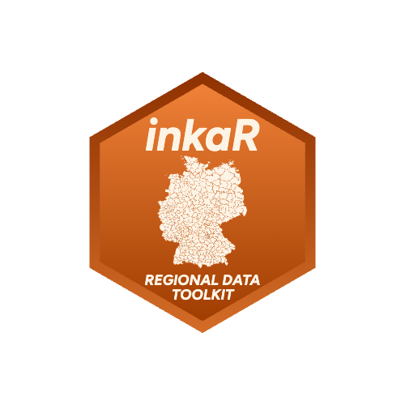

<!-- README.md is generated from README.Rmd. Please edit that file -->

```{r, include = FALSE}
knitr::opts_chunk$set(
  collapse = TRUE,
  comment = "#>",
  fig.path = "man/figures/README-",
  out.width = "100%"
)
```

# inkaR 

<!-- badges: start -->
[](https://github.com/ofurkancoban/inkaR/actions/workflows/R-CMD-check.yaml)
<!-- badges: end -->

The `inkaR` package provides a professional, fast, and feature-rich R interface to download and analyze spatial development indicators from the [BBSR INKAR](https://www.inkar.de/) (Indikatoren und Karten zur Raum- und Stadtentwicklung) database.

Designed for researchers and data scientists, `inkaR` abstracts away the complex JSON API of INKAR into clean, analytical data frames. Version 0.6.0 introduces a premium interactive wizard, multi-indicator support with automatic joining, and high-end visualization themes.

## Key Features

1.  **Interactive Selection Wizard**: Run `inkaR()` without arguments for a guided terminal session.
2.  **Multi-Indicator Support**: Download and merge multiple variables at once (Vertical or Horizontal joins).
3.  **Bilingual Fuzzy Search**: Intelligent, error-tolerant search for both German and English indicator names.
4.  **Usage History & Favorites**: Highlighting frequently used indicators for a personalized experience.
5.  **Professional Visualizations**: Dedicated ggplot2 themes (`theme_inkaR`) for publication-ready maps.
6.  **Optimized Performance**: Intelligent persistent caching and parallel API discovery.

## Installation

You can install the released version of inkaR from [CRAN](https://CRAN.R-project.org/package=inkaR) with:

``` r
install.packages("inkaR")
```

And the development version from [GitHub](https://github.com/ofurkancoban/inkaR) with:

``` r
# install.packages("devtools")
devtools::install_github("ofurkancoban/inkaR")
```

## Quick Start

### 1. Interactive Selection (Wizard Mode)

Simply call `inkaR()` in an interactive R session. A professional selection wizard will guide you through:
-   **Indicator Discovery**: Search with keywords (supports fuzzy matching).
-   **Spatial Level Selection**: Automatically probes the API for available levels (Districts, States, etc.).
-   **Year Selection**: Choose specific years or download the entire time series.

``` r
library(inkaR)
# Launch the Interactive Wizard
df <- inkaR() 
```

### 2. Analytical Multi-Indicator Download

You can download multiple datasets and join them automatically. Choose between a "Long" (stacked) format or a "Wide" (analytical) format with indicators as columns.

``` r
# Horizontal Join: Indicators as side-by-side columns
df_wide <- inkaR(
  variable = c("bip", "xbev"), 
  level    = "KRE", 
  year     = 2021, 
  lang     = "en", 
  format   = "wide"
)

# Ready for direct calculation:
# df_wide$bip_per_capita <- df_wide$bip / df_wide$`Total population`
```

### 3. Professional Mapping

`inkaR` integrates seamlessly with `sf` and `ggplot2` to render premium maps.

``` r
# Plot with the premium High-End theme (Dark or Light mode)
plot_inkar(df_wide, mode = "dark")
```

## Available Spatial Levels

-   `KRE`: Districts (Kreise / Kreisfreie Städte)
-   `GEM`: Municipalities (Gemeinden)
-   `ROR`: Spatial Planning Regions (Raumordnungsregionen)
-   `BLD`: Federal States (Bundesländer)
-   `BND`: Federal Territory (Bund)

You can explore the full spatial hierarchy via `get_geographies()`.
