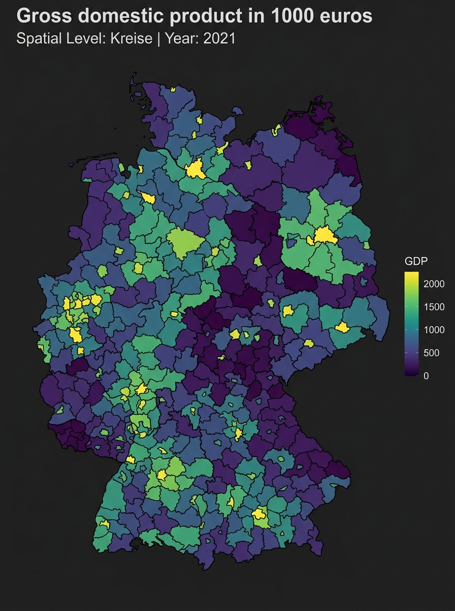

# Introduction to inkaR

## Overview

The `inkaR` package provides a modern R interface to the [BBSR
INKAR](https://www.inkar.de/) database — **Indikatoren und Karten zur
Raum- und Stadtentwicklung** (Indicators and Maps for Spatial and Urban
Development). INKAR is published by the German Federal Institute for
Research on Building, Urban Affairs and Spatial Development (BBSR) and
contains hundreds of regional indicators at multiple spatial levels
across Germany.

Key features:

- **Browse & Search**: Find indicators offline with
  [`view_indicators()`](https://ofurkancoban.github.io/inkaR/reference/view_indicators.md)
  and
  [`search_indicators()`](https://ofurkancoban.github.io/inkaR/reference/search_indicators.md).
- **Interactive Wizard**: Step-by-step guided download with
  [`select_indicator()`](https://ofurkancoban.github.io/inkaR/reference/select_indicator.md),
  [`select_level()`](https://ofurkancoban.github.io/inkaR/reference/select_level.md),
  and
  [`select_years()`](https://ofurkancoban.github.io/inkaR/reference/select_years.md).
- **Bilingual Output**: All results available in German (default) or
  English (`lang = "en"`).
- **Disk Caching**: API responses are cached locally — repeated calls
  return instantly.
- **Mapping**: Visualize downloaded data on German administrative maps
  with
  [`plot_inkar()`](https://ofurkancoban.github.io/inkaR/reference/plot_inkar.md).

## Installation

``` r
# From GitHub
remotes::install_github("ofurkancoban/inkaR")

library(inkaR)
```

------------------------------------------------------------------------

## 1. Browsing Indicators

The INKAR database contains hundreds of indicators. `inkaR` ships a
local metadata table (`indicators`) so you can explore and filter
without hitting the API.

### View the full list

Opens a searchable, sortable table in the RStudio viewer:

``` r
view_indicators()          # German names (default)
view_indicators("en")      # English names
```

### Search by keyword

``` r
search_indicators("GDP", lang = "en")
search_indicators("Arbeitslosigkeit")   # German search
```

Each result shows the `ID` (short code) and `M_ID` (numeric API key) you
need to download data.

### Retrieve as a data frame

``` r
df_meta <- get_indicators("en")
head(df_meta)
```

------------------------------------------------------------------------

## 2. Interactive Wizard

For guided, step-by-step downloads — especially useful in the RStudio
console:

``` r
# Step 1 – pick an indicator (searchable menu)
id <- select_indicator(lang = "en")

# Step 2 – pick the spatial level (e.g. KRE, GEM, BLD)
level <- select_level(id)

# Step 3 – pick the year(s)
years <- select_years(id, level)

# Step 4 – download
df <- get_inkar_data(id, level = level, year = years, lang = "en")
```

Each step can also be called independently when you already know some
parameters:

``` r
select_indicator("employment")   # pre-filters by keyword before showing the menu
```

------------------------------------------------------------------------

## 3. Downloading Data

[`get_inkar_data()`](https://ofurkancoban.github.io/inkaR/reference/get_inkar_data.md)
is the main download function.

### Basic download

``` r
# GDP (ID "011") for Districts (Kreise) — latest available year
df <- get_inkar_data("011", level = "KRE")
head(df)
#>   Kennziffer        Raumeinheit Aggregat  Zeit              Indikator     Wert
#> 1      01001    Flensburg (KSt)      KRE  2022 Bruttoinlandsprodukt_... 1234.5
```

### Specify year(s)

``` r
# Single year
df_2021 <- get_inkar_data("011", level = "KRE", year = 2021)

# Range of years
df_range <- get_inkar_data("011", level = "KRE", year = 2015:2021)
```

### English output

``` r
df_en <- get_inkar_data("011", level = "KRE", year = 2021, lang = "en")
head(df_en)
#>   region_id        region_name level_name year         indicator_name   value
#> 1     01001  Flensburg (KSt)        KRE  2021  Gross domestic pro... 1234.5
```

Column names in English mode:

| Column           | Description                     |
|------------------|---------------------------------|
| `region_id`      | Administrative key (Kennziffer) |
| `region_name`    | Region name                     |
| `level_name`     | Spatial level (e.g. KRE)        |
| `year`           | Reference year                  |
| `indicator_name` | English indicator label         |
| `value`          | Numeric value                   |

### Multiple indicators at once

Pass a vector of IDs to download and merge automatically:

``` r
df_multi <- get_inkar_data(c("011", "q_alo"), level = "KRE", year = 2021, lang = "en")
```

Results are merged by region and year into a wide-format tibble.

### Export to CSV

``` r
get_inkar_data("011", level = "KRE", csv = TRUE, export_dir = tempdir())
# Saves: inkar_011_KRE_Bruttoinlandsprodukt_<timestamp>.csv
```

------------------------------------------------------------------------

## 4. Spatial Levels

Common levels:

| Code  | German name                 | English                     |
|-------|-----------------------------|-----------------------------|
| `KRE` | Kreise / Kreisfreie Staedte | Districts                   |
| `GEM` | Gemeinden                   | Municipalities              |
| `ROR` | Raumordnungsregionen        | Spatial Planning Regions    |
| `BLD` | Bundeslaender               | Federal States              |
| `BND` | Bund                        | Federal Territory (Germany) |

Not all indicators are available at every level. Use
[`select_level()`](https://ofurkancoban.github.io/inkaR/reference/select_level.md)
to see which levels a given indicator supports, or call
[`get_geographies()`](https://ofurkancoban.github.io/inkaR/reference/get_geographies.md)
to list all available levels:

``` r
get_geographies()
```

------------------------------------------------------------------------

## 5. Mapping

[`plot_inkar()`](https://ofurkancoban.github.io/inkaR/reference/plot_inkar.md)
visualizes a downloaded data frame on German administrative boundaries.
It requires the `ggplot2`, `sf`, and `geodata` packages.

### Automatic Maps via GADM

By default, the function downloads boundaries from
[GADM](https://gadm.org/) and caches them. It supports: - `BND`: Federal
Territory (Germany as a whole - GADM Level 0) - `BLD`: Federal States
(GADM Level 1) - `KRE`: Districts (GADM Level 2) - `GEM`: Municipalities
(GADM Level 3)

``` r
# Download GDP for Districts
df <- get_inkar_data("011", level = "KRE", year = 2021, lang = "en")

# Plot — light theme (default)
plot_inkar(df)

# Dark theme
plot_inkar(df, mode = "dark")
```

Below is an example of the dark mode map output generated by
[`plot_inkar()`](https://ofurkancoban.github.io/inkaR/reference/plot_inkar.md):



### Custom Geometries

If you want to use custom boundaries (e.g. `ROR` Raumordnungsregionen,
or custom shapefiles), you can pass an `sf` object directly to the
`geom` parameter.
[`plot_inkar()`](https://ofurkancoban.github.io/inkaR/reference/plot_inkar.md)
will skip the GADM download and merge your data with the custom spatial
data frame:

``` r
# Load your custom spatial data frame (e.g. from an sf shapefile)
# my_shapes <- sf::read_sf("path/to/shapes.shp")

# Plot using custom geometry
# plot_inkar(df, geom = my_shapes)
```

------------------------------------------------------------------------

## 6. Caching

`inkaR` caches API responses to your user data directory
(`tools::R_user_dir("inkaR", "cache")`). Caches expire after 24 hours.
To clear them manually:

``` r
clear_inkar_cache()
```

------------------------------------------------------------------------

## 7. Analysis Helpers

### Filter to specific regions or districts

You can filter downloaded datasets to specific regions using either the
plural or singular helpers. For districts, you can also filter by their
administrative key (Kennziffer/ID):

``` r
df <- get_inkar_data("011", level = "KRE", lang = "en")

# Filter regions (by name)
df_cities <- compare_regions(df, c("Berlin", "Hamburg", "München"))
df_city   <- compare_region(df, "Berlin") # Singular alias

# Filter districts (by name or district ID/Kennziffer)
df_districts <- compare_districts(df, c("01001", "Hamburg"))
df_district  <- compare_district(df, "02000") # Singular alias
```

### Plot trends over time

``` r
inkar_trends(df, regions = c("Berlin", "Hamburg"))
```

### Theme-filtered search

``` r
get_themes()                                   # list all themes
search_indicators("employment", theme = "Arbeitsmarkt")
view_indicators("en", theme = "Bevölkerung")
```

------------------------------------------------------------------------

## Quick Reference

| Function                                                                                     | Purpose                                                                                                         |
|----------------------------------------------------------------------------------------------|-----------------------------------------------------------------------------------------------------------------|
| [`inkar()`](https://ofurkancoban.github.io/inkaR/reference/inkar_shortcut.md)                | English shortcut — latest year, EN output                                                                       |
| [`get_inkar_data()`](https://ofurkancoban.github.io/inkaR/reference/get_inkar_data.md)       | Download indicator data from the API                                                                            |
| [`inkaR()`](https://ofurkancoban.github.io/inkaR/reference/inkaR.md)                         | Full-featured download with interactive wizard                                                                  |
| [`view_indicators()`](https://ofurkancoban.github.io/inkaR/reference/view_indicators.md)     | Browse all indicators in a viewer table                                                                         |
| [`search_indicators()`](https://ofurkancoban.github.io/inkaR/reference/search_indicators.md) | Search indicators by keyword                                                                                    |
| [`get_indicators()`](https://ofurkancoban.github.io/inkaR/reference/get_indicators.md)       | Return indicator metadata as a data frame                                                                       |
| [`get_themes()`](https://ofurkancoban.github.io/inkaR/reference/get_themes.md)               | List indicator themes/domains                                                                                   |
| [`select_indicator()`](https://ofurkancoban.github.io/inkaR/reference/select_indicator.md)   | Interactive menu to pick an indicator                                                                           |
| [`select_level()`](https://ofurkancoban.github.io/inkaR/reference/select_level.md)           | Interactive menu to pick a spatial level                                                                        |
| [`select_years()`](https://ofurkancoban.github.io/inkaR/reference/select_years.md)           | Interactive menu to pick year(s)                                                                                |
| [`get_geographies()`](https://ofurkancoban.github.io/inkaR/reference/get_geographies.md)     | List available spatial levels                                                                                   |
| [`compare_regions()`](https://ofurkancoban.github.io/inkaR/reference/compare_regions.md)     | Filter downloaded data to named regions                                                                         |
| [`compare_region()`](https://ofurkancoban.github.io/inkaR/reference/compare_regions.md)      | Singular alias for [`compare_regions()`](https://ofurkancoban.github.io/inkaR/reference/compare_regions.md)     |
| [`compare_districts()`](https://ofurkancoban.github.io/inkaR/reference/compare_districts.md) | Filter data by district names or IDs                                                                            |
| [`compare_district()`](https://ofurkancoban.github.io/inkaR/reference/compare_districts.md)  | Singular alias for [`compare_districts()`](https://ofurkancoban.github.io/inkaR/reference/compare_districts.md) |
| [`inkar_trends()`](https://ofurkancoban.github.io/inkaR/reference/inkar_trends.md)           | Line chart of indicator values over time                                                                        |
| [`plot_inkar()`](https://ofurkancoban.github.io/inkaR/reference/plot_inkar.md)               | Plot downloaded data on a map                                                                                   |
| [`clear_inkar_cache()`](https://ofurkancoban.github.io/inkaR/reference/clear_inkar_cache.md) | Clear the local API response cache                                                                              |
